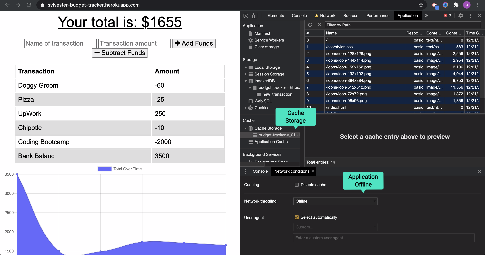

# Budget Tracker

 

## Description
Budget Tracker is a Progressive Web Application (PWA) where users can visually track their spending. Additional or subtracted funds can be applied to the total budget amount and the chart will shift to reflect this input. IndexedDB and the Cache API are used to enable this application to function offline as a PWA. 

## Table of Contents
  - [Usage](#Usage)
  - [Installation](#installation)
  - [Technology Used](#technology-used)
  - [Questions](#questions)
  - [Links](#links)
  - [License](#license)
  
## Usage

#### Online Application:

 #### Offline Inputs using IndexedDB:
 

 #### Offline Functionality using Cached Assets:

  
  ## Installation
  Node.js, NPM, and MongoDB must be installed on your computer.
  Clone the repo: 
      `git clone https://github.com/CFsylvester/budget-tracker.git`
  Navigate to the root directory and run: 
      `npm install`
  To start the server locally, run the following: 
      `npm start`
  Navigate to <b>localhost:3001</b> in your browser to open the application locally.

  ## Technology Used
    
    
    
    
    
    
    
    
  
  ## Questions
  Please visit my **[GitHub profile](https://github.com/CFsylvester)** 

  ## Links
  - **[Deployed App](https://sylvester-budget-tracker.herokuapp.com/)**
  - **[GitHub Repo](https://github.com/CFsylvester/budget-tracker)** 
  - **[GitHub profile](https://github.com/CFsylvester)**
  - **[My Portfolio](clairecodes.dev)**
  - **[Connect on LinkedIn](https://www.linkedin.com/in/claire-sylvester-386373143/)**

  ## License   
  This app is licensed under the MIT license.
